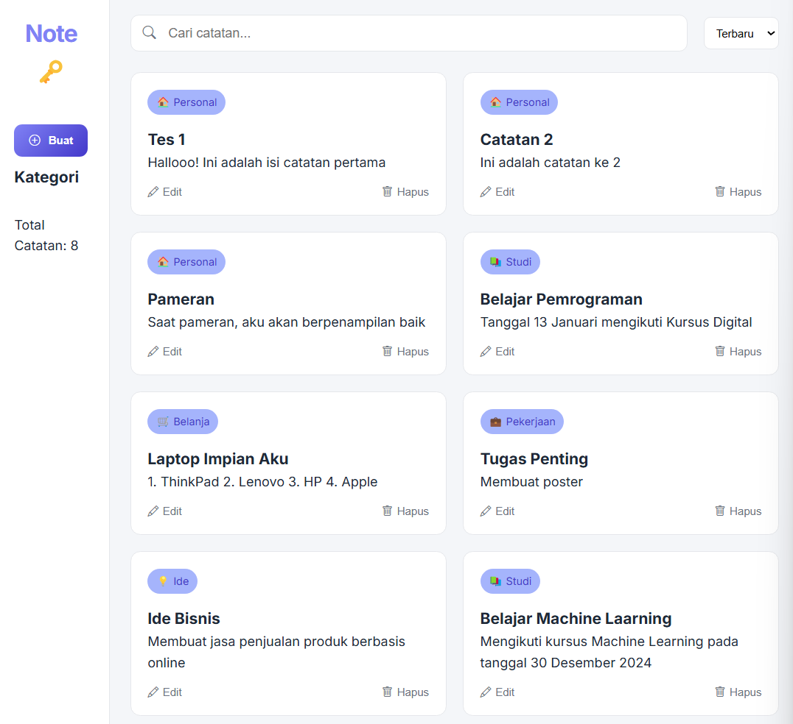

# 📝 MyNotes: Your Digital Safe Space

A beautifully designed personal notes application where you can store your thoughts, ideas, and memories securely. Keep your daily reflections organized and accessible anytime, anywhere.

## ✨ Key Features

- Create and manage personal notes
- Clean and minimalist user interface
- Private and secure note taking experience
- Simple text formatting options
- Quick search functionality
- Organization through tags or categories

## 🚀 Getting Started

### Prerequisites

- Web browser (Chrome, Firefox, Safari, or Edge)
- Basic understanding of note organization

### Installation

1. Clone this repository to your local machine:
```bash
git clone https://github.com/rexzea/NotePad.git
```

2. Navigate to the project directory:
```bash
cd Node
```

3. Open `index.html` in your preferred web browser

## 💫 Why MyNotes?

- **Privacy First**: Your thoughts remain yours
- **Distraction-Free**: Clean interface for focused writing
- **Always Available**: Access your notes whenever you need them
- **Easy to Use**: Start writing with just one click
- **Organized Thoughts**: Keep your ideas structured and findable

## 🎯 Usage Guide

1. Click the "New Note" button to create a fresh entry
2. Write your thoughts freely in the text editor
3. Use tags to categorize your notes (optional)
4. Your notes are automatically saved as you type
5. Use the search bar to find specific notes

## 🛠️ Built With

- HTML5
- CSS3
- JavaScript
- Love for organized thoughts 💝

## 📱 Preview




## 🔜 Upcoming Features

- Cloud sync capabilities
- Rich text formatting
- Voice notes support
- Export options

## 🤝 Contributing

Your contributions are welcome! Here's how you can help:

1. Fork the repository
2. Create your feature branch (`git checkout -b feature/NewFeature`)
3. Commit your changes (`git commit -m 'Add some NewFeature'`)
4. Push to the branch (`git push origin feature/NewFeature`)
5. Open a Pull Request

## 📜 License

This project is licensed under the MIT License - see the [LICENSE](LICENSE) file for details.

## 📞 Contact

Email : futzfary@gmail.com

No : +62 898-8610-455


## 💝 Support

If you find this project useful, consider:
- Giving it a star ⭐
- Sharing it with friends
- Contributing to its development

---
Created with 💖 by [REXZEA] - Your thoughts deserve a beautiful home
